# INDEX — fogg-habit 技能套件总览

> 基于 《福格行为模型》(Tiny Habits) BJ Fogg, 2020
> 最后更新: 2026-07-08

---

## 技能列表（按推荐学习/使用顺序）

### Layer 1: 入口

| # | Skill | 描述 | 路径 |
|---|-------|------|------|
| 1 | fogg-habit | 意图识别与路由分发中心。识别用户意图后分发到对应子技能或直接回答 B=MAP 速查 | `skills/fogg-habit/` |

### Layer 2: 基础

| # | Skill | 描述 | 路径 |
|---|-------|------|------|
| 2 | fogg-habit-core | B=MAP 诊断排错 + 微行为设计（ABC 三步骤），个人习惯的完整闭环 | `skills/fogg-habit-core/` |
| 3 | fogg-habit-break | 三阶段渐进戒除：先建新 → 终止旧（反向 B=MAP）→ 替换旧（顶替） | `skills/fogg-habit-break/` |

### Layer 3: 进阶

| # | Skill | 描述 | 路径 |
|---|-------|------|------|
| 4 | fogg-habit-grow | 庆祝设计 × 帮别人改变 × 身份认同，习惯的深化与固化 | `skills/fogg-habit-grow/` |
| 5 | fogg-habit-social | 群体行为设计：7 步流程 + 头目/忍者角色 + 四分区模型 + 强力区反馈 | `skills/fogg-habit-social/` |

---

## 功能矩阵

| 功能 | fogg-habit | core | break | grow | social |
|------|:----------:|:----:|:-----:|:----:|:------:|
| 意图识别与路由 | ✅ | — | — | — | — |
| B=MAP 诊断排错 | — | ✅ | — | — | — |
| 愿望→黄金行为行为设计 | — | ✅ | — | — | — |
| ABC 三步骤配方 | — | ✅ | — | — | — |
| 珍珠习惯 / 顺便习惯 | — | ✅ | — | — | — |
| 改变的 5 大技巧 | — | ✅ | — | — | — |
| 反向 B=MAP 戒除 | — | — | ✅ | — | — |
| 3 阶段渐进戒除 | — | — | ✅ | — | — |
| 庆祝设计 / Shine | — | — | — | ✅ | — |
| 庆祝闪电战 | — | — | — | ✅ | — |
| 帮别人改变（一对一） | — | — | — | ✅ | — |
| 身份认同（三阶段） | — | — | — | ✅ | — |
| 自动化度光谱 | — | — | — | ✅ | — |
| 群体行为设计 7 步 | — | — | — | — | ✅ |
| 头目 / 忍者角色 | — | — | — | — | ✅ |
| 海豚/海龟/螃蟹/贝壳分区 | — | — | — | — | ✅ |
| 女王 B 解决方案 | — | — | — | — | ✅ |
| 强力区反馈框架 | — | — | — | — | ✅ |

---

## 引用关系图

```mermaid
graph TD
    habit[fogg-habit<br/>主入口/路由] --> core[fogg-habit-core<br/>诊断+设计]
    habit --> break[fogg-habit-break<br/>戒除]
    habit --> grow[fogg-habit-grow<br/>进阶]
    habit --> social[fogg-habit-social<br/>群体设计]

    core -.-> |需要设计顶替行为时引向| break
    core ==> |庆祝步骤引向深入设计| grow
    core ==> |完成后自然浮现身份议题| grow

    break ==> |顶替行为设计需要| core
    break -.-> |戒除成功后身份转变| grow

    grow ==> |身份需要新行为支撑| core
    grow -.-> |帮别人进阶到群体| social

    social ==> |群体设计回到个人基础| core
    social -.-> |团队庆祝和反馈| grow

    %% 图例
    subgraph Legend
        L1([depends-on: A需要B才能运作]) 
        L2[-.- contrasts-with: A和B是互补视角]
        L3[==> composes-with: A和B经常配合使用]
    end
```



---

## 推荐学习路径

```
个人基础闭环:
  1. fogg-habit (了解全貌)
  2. fogg-habit-core (掌握诊断+设计，建立第一个微习惯)

实战应用:
  3. fogg-habit-break (学会戒除坏习惯)

深化巩固:
  4. fogg-habit-grow (庆祝设计 → 帮别人 → 身份认同)

扩展延伸:
  5. fogg-habit-social (将方法论应用于团队和组织)
```

---

## 引用文档

| 文档 | 类型 | 说明 |
|------|------|------|
| `BOOK_OVERVIEW.md` | 元文档 | 整书骨架理解、核心命题、批判分析 |
| `references/diagnose.md` | 设计参考 | 诊断排错模式的详细参考 |
| `references/design.md` | 设计参考 | 行为设计模式的详细参考 |
| `references/break-habit.md` | 设计参考 | 戒除坏习惯的详细参考 |
| `references/celebrate.md` | 设计参考 | 庆祝设计的详细参考 |
| `references/help-others.md` | 设计参考 | 帮别人改变的详细参考 |
| `references/identity.md` | 设计参考 | 身份认同的详细参考 |
| `references/social-design.md` | 设计参考 | 群体行为设计的详细参考 |
| `references/toolkit-celebrations.md` | 工具箱 | 100 种庆祝方式分类清单 |

---

## 审计轨迹

- `BOOK_OVERVIEW.md` — 阶段 0：整书理解
- 本 INDEX.md — 阶段 3：Zettelkasten 链接
- `skills/*/test-prompts.json` — 阶段 4：压力测试
- 现有 skill 为手动创作，非通过 candidate → verify 流水线生成
