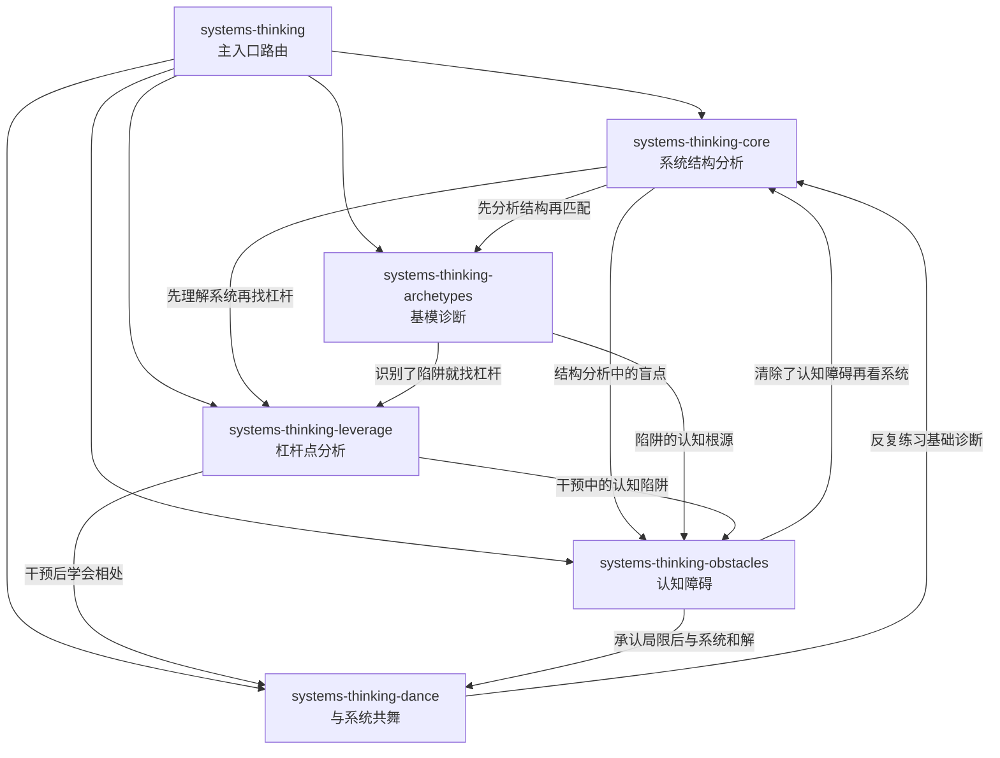

# systems-thinking-skills — 总览

> 基于《系统之美》蒸馏的 6 个可执行 skill，按 cangjie-skill RIA++ 标准构建。
> 蒸馏时间: 2026-07-08

---

## Skill 列表

| # | Skill | Slug | 类型 | 来源章节 |
|---|-------|------|------|---------|
| 1 | 主入口路由 | `systems-thinking` | router | 全书 |
| 2 | 系统结构分析 | `systems-thinking-core` | diagnosis | 第1-3章 |
| 3 | 基模诊断 | `systems-thinking-archetypes` | diagnosis | 第5章 |
| 4 | 杠杆点分析 | `systems-thinking-leverage` | action | 第6章 |
| 5 | 认知障碍 | `systems-thinking-obstacles` | meta-cognition | 第4章 |
| 6 | 与系统共舞 | `systems-thinking-dance` | philosophy | 第7章 |

---

## 引用关系图



---

## 关系类型

| 关系 | 含义 | 示例 |
|------|------|------|
| **depends-on** | A 的执行依赖 B 的产出 | leverage depends-on core（必须先分析结构再找杠杆） |
| **contrasts-with** | A 和 B 互补但不同 | archetypes contrasts-with obstacles（一个看外部陷阱，一个看内部认知） |
| **composes-with** | A 和 B 可以组合使用 | core composes-with archetypes（分析完结构后匹配陷阱） |
| **precedes** | A 通常在 B 之前 | core precedes leverage（先诊断再干预） |

---

## 典型用户路径

### 路径 1: 标准诊断
```
用户: "这个项目为什么总是延期？"
→ core (分析结构: 需求变更→开发→卡在测试→延期)
→ archetypes (识别陷阱: 可能是转嫁负担——每次都靠加班救火)
→ leverage (找杠杆: 改变"需求冻结"规则 #5)
→ dance (学会接受: 不可能完全消除延期，但可以设计更聪明的流程)
```

### 路径 2: 快速干预
```
用户: "怎么改变团队的文化？"
→ leverage (直接扫描: 这更像范式级问题 #2，不能用激励制度解决)
→ dance (范式变革需要时间，先从小胜利开始)
```

### 路径 3: 认知校正
```
用户: "我明明分析了数据，为什么结果还是出乎意料？"
→ obstacles (识别障碍: 可能是'别被表象迷惑' + '非线性')
→ core (用正确视角重新分析)
```

### 路径 4: 哲学出口
```
用户: "学完系统思考后，我反而觉得更无力了..."
→ dance (这正是第7章的核心: 放弃控制≠放弃行动)
→ core (从小的、自己能影响的系统重新开始)
```

---

## 审计信息

- **来源**: 《系统之美：决策者的系统思考》德内拉·梅多斯
- **蒸馏方法**: cangjie-skill RIA++ 四阶段流水线
- **质量门**: 全部 skill 通过 V1(跨域) / V2(预测力) / V3(独特性) 三重验证
- **压力测试**: 待完成 (test-prompts.json)
