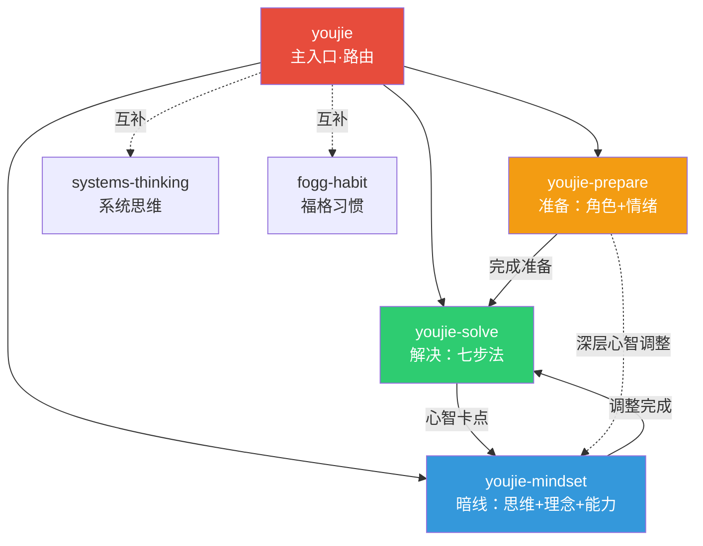

# INDEX.md — 有解 KSME 问题解决技能索引

> 基于《有解：高效解决问题的关键7步》（奉湘宁、顾淑伟，2022，人民邮电出版社）蒸馏的技能套件。

## 技能清单

| 技能 | 定位 | 核心功能 | 触发场景 |
|------|------|---------|---------|
| **youjie** | 主入口 | 意图识别 + 路由分发 + KSME 速查 | 模糊/学习类问题，首次接触 KSME |
| **youjie-prepare** | 前置准备 | 角色转换 + 情绪管理 + 信念转换 | 情绪不稳、无从下手、自我怀疑 |
| **youjie-solve** | 核心引擎 | KSME七步法完整引导（30+ 工具） | 明确有具体问题需要系统解决 |
| **youjie-mindset** | 暗线支撑 | 7个思维转换 + 7个理念 + 4种能力 | 心智卡点、思维惯性、能力瓶颈 |

## 引用关系图



## 工具全景图

以下工具按七步法分布，标注了在原书中的章节来源。

### 第一步：确定问题
| 工具 | 功能 | 来源章节 |
|------|------|---------|
| 问题清单 | 外化所有问题，防止过度思考 | 第3章第1节 |
| 价值罗盘 | 8→3 澄清价值观，判断重要性 | 第3章第2节 |
| 紧急重要模型 | 四象限优先级分类 | 第3章第2节 |
| 连线筛选法 | 找到"问题之王" | 第3章第3节 |
| 有的放矢有的放手 | 忽略不重要问题 | 第3章第3节 |

### 第二步：梳理关系人
| 工具 | 功能 | 来源章节 |
|------|------|---------|
| 人际生态图 | 可视化个人关系全貌 | 第4章第1节 |
| 关系人图 | 锁定解决特定问题的盟友 | 第4章第1节 |
| 双重身份模型 | 区分关系人/问题管理者 | 第4章第1节 |
| 关系体检表 | 量化评估关系质量 | 第4章第2节 |
| 关系人需求表 | 了解盟友的真正需求 | 第4章第2节 |

### 第三步：明确现状
| 工具 | 功能 | 来源章节 |
|------|------|---------|
| 观点vs事实区分法 | 事实层描述，避免观点陷阱 | 第5章第1节 |
| 警惕高度概括 | 识别负面标签 | 第5章第1节 |
| 负面标签剥离 | 用正面标签取代负面标签 | 第5章第1节 |
| 细化与量化（MECE） | 不重叠不遗漏地拆分问题 | 第5章第2节 |
| 1-10标尺法 | 量化难以度量的主观指标 | 第5章第2节 |
| 影响圈 | 从自己能掌控的问题入手 | 第5章第2节 |

### 第四步：明确目标
| 工具 | 功能 | 来源章节 |
|------|------|---------|
| 问题→目标转换 | 从"为什么"到"要什么" | 第6章第1节 |
| SMART原则 | 具体/可度量/可达成/相关/有时限 | 第6章第2节 |
| 蓝莓枝修剪 | 双目标清单，聚焦最重要目标 | 第6章第1节 |
| 目标转向 | 区分路径与真正目标 | 第6章第1节 |
| 目标平衡 | 多维度平衡（健康/家庭/事业） | 第6章第1节 |
| 愿望强度评估 | 1%-100% 量化达成意愿 | 第6章第2节 |

### 第五步：明确差距与代价
| 工具 | 功能 | 来源章节 |
|------|------|---------|
| Delta差距计算 | 量化现状与目标的差距 | 第6章第3节 |
| 代价量化 | 明确不采取行动的惨重代价 | 第6章第3节 |
| 他律vs自律 | 在自己面前树立权威 | 第6章第3节 |

### 第六步：制定解决方案
| 工具 | 功能 | 来源章节 |
|------|------|---------|
| P=p-i绩效公式 | 表现=潜能-干扰 | 第7章第1节 |
| KSME四通道 | K知识/S技能/M动机/E环境 | 第7章第1节 |
| 头脑风暴 | 发散思维穷举方案 | 第7章第2节 |
| 六顶思考帽 | 收敛思维筛选方案 | 第7章第2节 |
| 真心欣赏 | 给情感账户存款 | 第7章第3节 |
| 信任与托付 | 制造信任循环 | 第7章第3节 |
| 情感账户 | 关系中隐形的存取款概念 | 第7章第3节 |
| 谁的问题谁做主 | 尊重问题所有人自主权 | 第7章第2节 |

### 第七步：拟定行动计划
| 工具 | 功能 | 来源章节 |
|------|------|---------|
| 谁先改变 | 谁想解决问题谁先改 | 第8章第1节 |
| 从小开始 | 5分钟智慧，降低启动门槛 | 第8章第2节 |
| 行动计划表 | 谁/做什么/何时/成果 | 第8章第2节 |
| PDCA循环 | 计划-执行-检查-处理的迭代 | 第8章第3节 |
| 目标回归线 | 可视化行动与目标的对齐 | 第8章第3节 |

## 明线与暗线

```
明线（怎么做）：
  确定问题 → 梳理关系人 → 明确现状 → 明确目标 → 明确差距 → 制定方案 → 拟定计划

暗线（能不能做到）：
  7个思维转换 → 7个核心理念 → 4种核心能力
      ↓              ↓              ↓
  认知层重建    信念层重建    能力层实践
```

## 与其他技能的关系

| 外部技能 | 关系类型 | 衔接点 |
|---------|---------|--------|
| systems-thinking | 互补 | 系统思维分析"为什么"，有解决定"怎么做" |
| fogg-habit | 互补 | 第七步"行动计划"衔接福格B=MAP行为模型 |
| complex-problem-solver | 互补 | 12大思维模型广度覆盖，有解深度专精 |

---

*生成时间：2026-07-08 | cangjie-skill RIA-TV++ 流水线*
